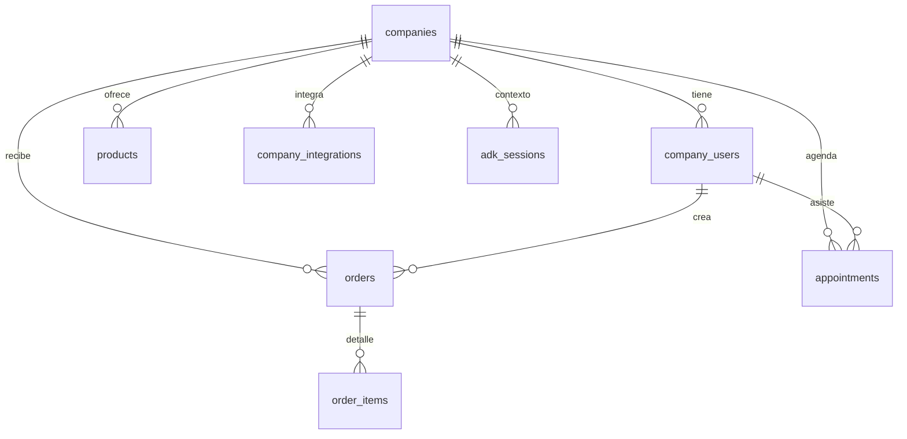

# Base de Datos General

La base usa PostgreSQL (Supabase) con aislamiento lógico por `company_id`. A continuación se muestra un diagrama resumido y las notas de cada entidad.

## Tabla `companies`
- `id`: UUID primario.
- `name`: Nombre visible.
- `whatsapp_phone_id`: **Obligatorio** para multi-tenant; coincide con el `metadata.phone_number_id` que envía Meta.
- `whatsapp_display_phone_number`: Número legible para mostrar en mensajes o logs.
- `whatsapp_admin_phone_ids`: Arreglo de números de teléfono (MSISDN) sanitizados autorizados como administradores por defecto.
- `config`: JSONB con ajustes por compañía (tono, inventario, etc.).
- Timestamps `created_at`, `updated_at`.

## Tabla `company_users`
- `company_id` + `phone` tienen `UNIQUE` para evitar duplicados.
- `role`: Enum `ADMIN` o `CLIENT`.
- `embedding`: Vector pgvector reservado para memoria semántica.
- Se usa para convertir remitentes regulares en usuarios persistentes.

## Tabla `company_integrations`
- `provider`: Enum (`BANK_ECOFUTURO`, `GOOGLE_CALENDAR`, `WALLET_TRON`).
- `encrypted_credentials`: JSONB cifrado con AES.
- `needs_2fa_attention`: Bandera usada para notificar a los admins.
- `updated_at`: se refresca en cada upsert.

## Tabla `products`
- Catálogo maestro por compañía: `sku`, `name`, `price`, `stock_quantity`, `image_url`.

## Tabla `orders`
- `user_id` referencia a `company_users`.
- `status`: Enum (`CART`, `AWAITING_QR`, `QR_SENT`, `VERIFYING_PAYMENT`, `COMPLETED`, `FAILED`, `REQUIRES_2FA`).
- `details`: texto corto usado como referencia bancaria (ej. `REF-XXXX`).
- `metadata`: JSONB extensible.

## Tabla `order_items`
- Relación N:1 con `orders` y `products`.
- `unit_price` y `quantity` almacenan la foto del momento del pedido.

## Tabla `appointments`
- `status`: Enum (`PENDING_SYNC`, `CONFIRMED`, `CANCELLED`, `RESCHEDULED`, `COMPLETED`).
- Índice compuesto + restricción única `appointments_company_slot_unique (company_id, start_time, end_time)` para evitar traslapes dentro de la misma empresa.
- Campos adicionales para sincronización Google: `google_event_id`, `google_html_link`.

## Tabla `adk_sessions`
- `session_id`: Clave `${company_id}:${sender}`.
- `context_data`: JSONB con historial y metadatos usados por Google ADK.

## Reglas Clave
1. **Siempre** filtra por `company_id` al consultar/insertar datos para mantener el aislamiento lógico.
2. El webhook de WhatsApp resuelve la compañía mediante `whatsapp_phone_id`; por eso la combinación `companies.whatsapp_phone_id` + `company_users.phone` define el rol del remitente.
3. Para nuevas compañías, asegúrate de poblar `whatsapp_phone_id`, `whatsapp_admin_phone_ids` (con números de teléfono) y de pasar por el onboarding de Google para habilitar los flujos administrativos.

