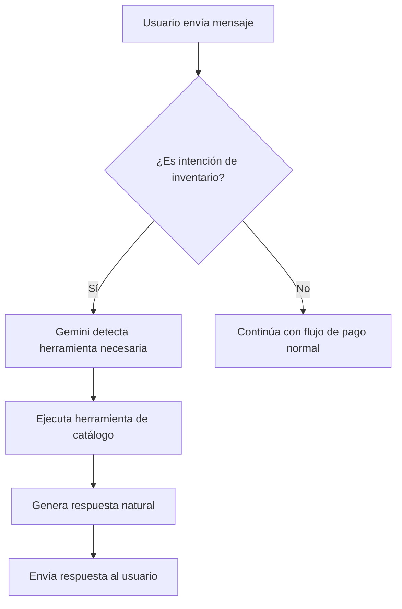

# Integración de Catálogo Meta

## Descripción General

Este módulo proporciona sincronización bidireccional entre el inventario en Supabase y el catálogo de productos de Meta (Facebook/WhatsApp Business).

## Configuración

### Variables de Entorno

```env
META_API_TOKEN=tu_token_de_meta_api
WHATSAPP_API_VERSION=v24.0
```

### Configuración en Supabase

En la tabla `companies`, asegúrate de tener configurado el campo `business_catalog_id` con el ID del catálogo de Meta:

```sql
UPDATE companies 
SET business_catalog_id = '2902117086655075' 
WHERE id = 'tu-company-id';
```

## Herramientas Disponibles

El Sales Agent puede utilizar las siguientes herramientas automáticamente según el contexto de la conversación:

### 1. Sincronizar Inventario hacia Meta
**Tool Type:** `sync_inventory_to_meta`

Sincroniza todos los productos de Supabase hacia el catálogo de Meta.

**Ejemplo de uso por el usuario:**
- "Actualiza el catálogo de Meta"
- "Sincroniza los productos con Facebook"

### 2. Sincronizar Inventario desde Meta
**Tool Type:** `sync_inventory_from_meta`

Trae los productos del catálogo de Meta hacia Supabase.

**Ejemplo de uso por el usuario:**
- "Importa los productos de Meta"
- "Trae el inventario de Facebook"

### 3. Buscar Productos
**Tool Type:** `search_products`
**Parámetros:** `searchTerm` (string)

Busca productos en el catálogo de Meta por nombre.

**Ejemplo de uso por el usuario:**
- "Busca productos con 'camisa'"
- "¿Tenemos productos de 'zapatos'?"

### 4. Obtener Información de Producto
**Tool Type:** `get_product_info`
**Parámetros:** `productId` (string)

Obtiene información detallada de un producto específico.

**Ejemplo de uso por el usuario:**
- "Dame información del producto ABC123"
- "¿Qué características tiene el producto XYZ?"

### 5. Actualizar Disponibilidad
**Tool Type:** `update_product_availability`
**Parámetros:** `productId` (string), `available` (boolean)

Actualiza la disponibilidad de un producto en el catálogo.

**Ejemplo de uso por el usuario:**
- "Marca el producto ABC123 como no disponible"
- "El producto XYZ está en stock"

### 6. Listar Todos los Productos
**Tool Type:** `list_all_products`

Lista todos los productos del catálogo de Meta.

**Ejemplo de uso por el usuario:**
- "Lista todos los productos"
- "Muestra el inventario completo"

## Flujo de Funcionamiento



## API de Meta Catalog

### Endpoints Utilizados

#### Listar Productos
```http
GET https://graph.facebook.com/v24.0/{catalog_id}/products
?access_token={META_API_TOKEN}
&fields=retailer_id,id,name,price,availability,image_url,inventory
```

#### Batch Update
```http
POST https://graph.facebook.com/v24.0/{catalog_id}/items_batch
Content-Type: application/x-www-form-urlencoded

item_type=PRODUCT_ITEM
&requests=[...]
&access_token={META_API_TOKEN}
```

### Formato de Producto

```typescript
{
  id: string,              // retailer_id único
  title: string,           // Nombre del producto
  description: string,     // Descripción
  price: "100.00 MXN",    // Precio con moneda
  availability: "in stock" | "out of stock",
  condition: "new",
  image_link?: string,
  inventory?: number
}
```

## Estructura de Datos

### Tabla `products` en Supabase
```sql
CREATE TABLE products (
  id TEXT PRIMARY KEY,
  company_id UUID REFERENCES companies(id),
  name TEXT NOT NULL,
  description TEXT,
  price DECIMAL(10,2),
  image_url TEXT,
  stock_quantity INTEGER,
  is_available BOOLEAN DEFAULT true,
  brand TEXT,
  category TEXT,
  created_at TIMESTAMPTZ DEFAULT NOW(),
  updated_at TIMESTAMPTZ DEFAULT NOW()
);
```

### Tabla `companies` - Campo adicional
```sql
ALTER TABLE companies 
ADD COLUMN business_catalog_id TEXT;
```

## Ejemplos de Uso

### Uso Programático

```typescript
// En cualquier servicio con inyección de MetaCatalogService

// Sincronizar hacia Meta
const result = await metaCatalogService.syncInventoryToMeta(companyId);
console.log(`Sincronizados: ${result.synced}, Errores: ${result.errors}`);

// Buscar productos
const catalogId = await metaCatalogService.getCatalogId(companyId);
const products = await metaCatalogService.searchProducts(catalogId, 'camisa');

// Actualizar disponibilidad
const batchRequest = {
  method: 'UPDATE',
  retailer_id: 'PROD123',
  data: { availability: 'out of stock' }
};
await metaCatalogService.batchUpdateProducts(catalogId, [batchRequest]);
```

### Uso a través del Chat (Sales Agent)

El usuario simplemente escribe en lenguaje natural y el LLM decide qué herramienta usar:

```
Usuario: "Actualiza el catálogo con los nuevos productos"
Bot: "✅ Sincronización completada: 15 productos actualizados en Meta"

Usuario: "Busca productos de zapatos"
Bot: "Encontré 5 productos relacionados con zapatos:
     - Zapato Deportivo Nike Air
     - Zapato Formal Negro
     - ..."

Usuario: "El producto ABC123 ya no está disponible"
Bot: "✅ Producto ABC123 marcado como no disponible en el catálogo"
```

## Errores Comunes

### 1. Catalog ID no encontrado
**Error:** `No se encontró catalog_id para esta compañía`
**Solución:** Verifica que `business_catalog_id` esté configurado en la tabla `companies`

### 2. Token inválido
**Error:** `Invalid OAuth 2.0 Access Token`
**Solución:** Verifica que `META_API_TOKEN` sea válido y tenga los permisos necesarios

### 3. Rate Limiting
**Error:** `Too many calls for the batch uploads`
**Solución:** Implementa delay entre llamadas o agrupa más operaciones en un solo batch

## Logging y Debugging

El servicio registra todas las operaciones importantes:

```typescript
this.logger.debug('Sincronizando inventario...');
this.logger.error('Error en batch update:', error);
this.logger.warn('Catalog ID no encontrado');
```

Para ver los logs detallados, configura el nivel de log en NestJS:

```typescript
// main.ts
app.useLogger(['error', 'warn', 'log', 'debug']);
```

## Pruebas

### Probar Sincronización Manual

```bash
# Desde el código, puedes crear un endpoint de prueba:
# POST /whatsapp/test/sync-inventory
curl -X POST http://localhost:3000/whatsapp/test/sync-inventory \
  -H "Content-Type: application/json" \
  -d '{"companyId": "tu-company-id"}'
```

## Mejoras Futuras

- [ ] Webhooks de Meta para sincronización automática
- [ ] Cache de productos para reducir llamadas API
- [ ] Soporte para variantes de productos
- [ ] Imágenes múltiples por producto
- [ ] Sincronización programada (cron jobs)
- [ ] Dashboard de métricas de sincronización

## Referencias

- [Meta Product Catalog API](https://developers.facebook.com/docs/marketing-api/reference/product-catalog/)
- [Meta Batch API](https://developers.facebook.com/docs/marketing-api/catalog/guides/manage-catalog-items/catalog-batch-api)
- [Product Item Reference](https://developers.facebook.com/docs/marketing-api/reference/product-item/)
